# node-hello-deployment

## 📝 Table of Contents
- [About](#about)
- [Getting Started](#getting_started)
  - [Install dependencies](#prerequisites)
  - [Setup ArgoCD](#argocd-setup)
  - [Creating new ArgoCD app](#argocd-app)
  - [Run node-hello application](#node-hello)

## 🧐 About <a name = "about"></a>
Manifest repository for node-hello app deployment

## 🏁 Getting Started <a name = "getting_started"></a>
These instructions will get you a copy of the project up and running on your local machine for development and testing purposes. 

### 1. Install dependencies <a name = "prerequisites"></a>
Follow the documentations to install the following in your environment
- [Kubernetes](https://kubernetes.io/docs/setup/) - Container management application
```bash
# check if kubectl is installed correctly
$ kubectl version
Client Version: v1.30.0
Kustomize Version: v5.0.4-0.20230601165947-6ce0bf390ce3
Server Version: v1.29.2
```
- [Helm](https://helm.sh/docs/intro/install/) - Kubernetes package manager
```bash
# check if helm is installed correctly
$ helm version
version.BuildInfo{Version:"v3.15.0-rc.2", GitCommit:"c4e37b39dbb341cb3f716220df9f9d306d123a58", GitTreeState:"clean", GoVersion:"go1.22.2"}
```
- [Argo CD](https://argo-cd.readthedocs.io/en/stable/getting_started/) - GitOps CD tool for Kubernetes

```bash
# check if argocd is installed correctly
$ argocd version
argocd: v2.11.0+d3f33c0
  BuildDate: 2024-05-07T16:21:23Z
  GitCommit: d3f33c00197e7f1d16f2a73ce1aeced464b07175
  GitTreeState: clean
  GoVersion: go1.21.9
  Compiler: gc
  Platform: windows/amd64
argocd-server: v2.11.0+d3f33c0
```
kubectl config get-contexts -o name
argocd cluster add docker-desktop

### 2. Setup ArgoCD <a name = "argocd-setup"></a>
#### 2.1. Hosting argocd-server 
Get the port for argocd-server 
`$ kubectl -n argocd get all`

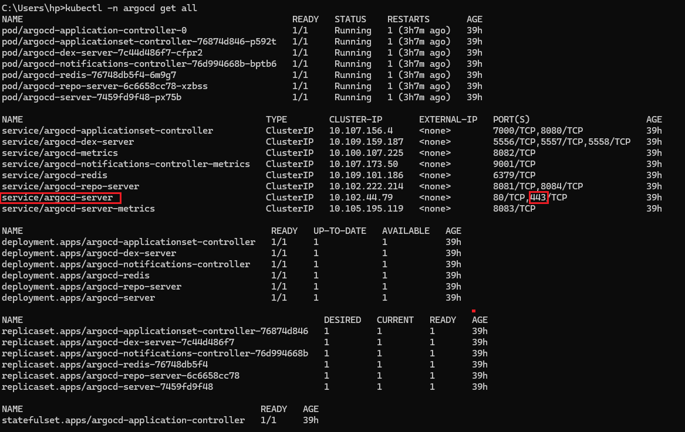

We will use port forwarding to host argocd-server with port *443* to *8080*

Using a new terminal type the command below and keep it running.

```bash
$ kubectl port-forward svc/argocd-server -n argocd 8080:443
```
Open http://localhost:8080 in any web browser to access Argo CD UI

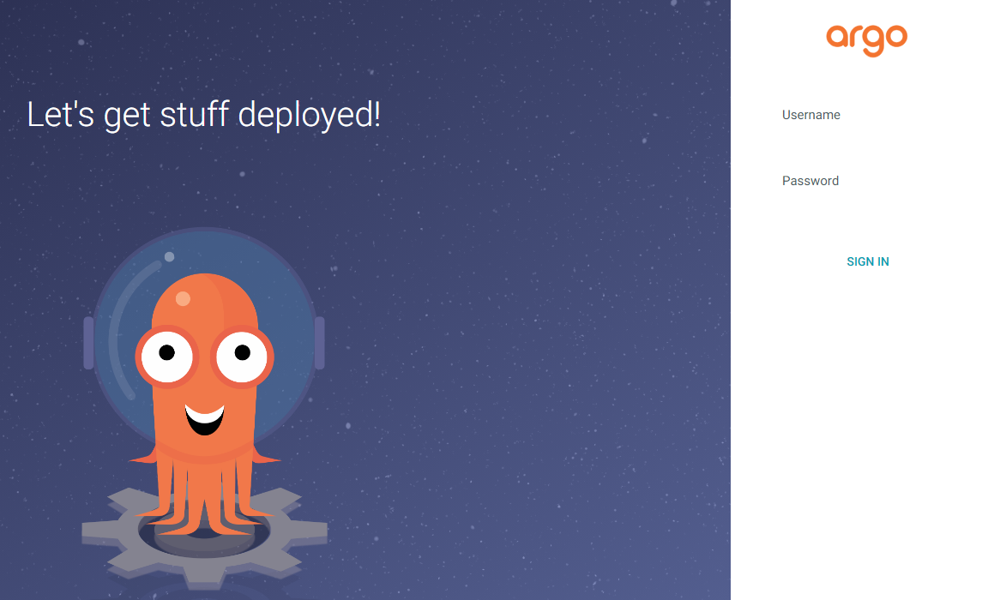

#### 2.2. Getting the credentials
> [!IMPORTANT] 
> Default username is **admin**.
> Argo CD automatically create an initial password for the first time login.

```bash
$ argocd admin initial-password -n argocd
```
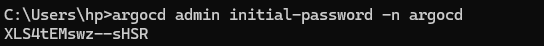

#### 2.3. Update password
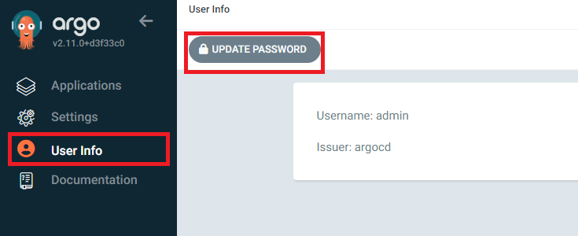

### 3. Creating ArgoCD app <a name = "argocd-app"></a>

Helm chart applications can also be created using the Argo web UI, without any CLI interactions. Click the New App button on the home screen and fill out the app’s basic details:

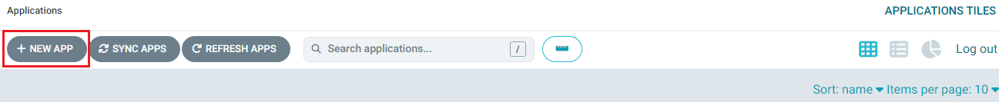

Scroll down the page and finish configuring your app by setting the destination Kubernetes cluster and the directory options to apply.
``` 
# Configurations for node-hello app
- application name: test
- project name: default
- sync policy: Manual
- repository link: https://github.com/ShreyaDadhich/node-hello-deployment.git
- path: node-hello-chart
- cluster url: https://kubernetes.default.svc
- namespace: test
```


Next, scroll down to the Source section. Enter the URL of your GitHub repository and then the path to your Helm chart.

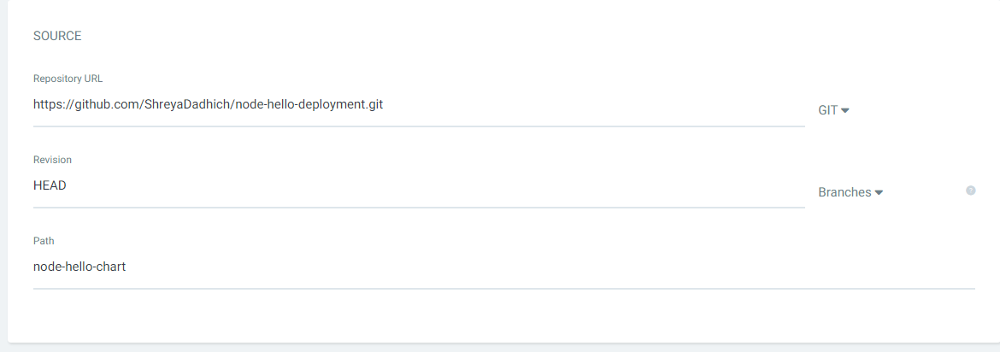
Finally, scroll down the page and finish configuring your app by setting the destination Kubernetes cluster and the directory options to apply.

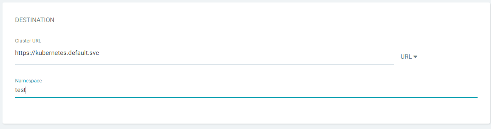
Finally create your app by pressing the **Create** button at the top of the flyout.

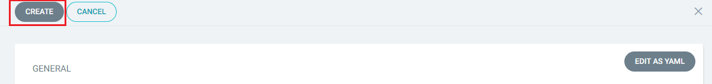

> [!NOTE]  
> `sync-policy` can be set to `automated` instead of `manual` which allows ArgoCD to automatically sync with the current changes in the application.

The objects defined by the Helm chart will be added to your cluster. 

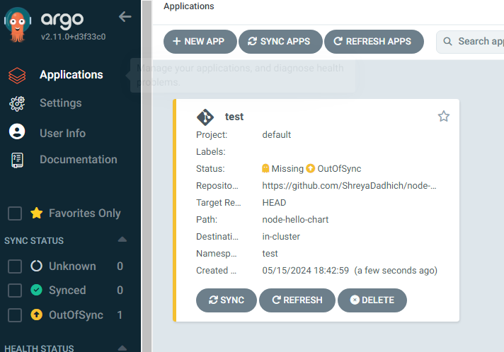

The app shows as **Missing** and **Out of Sync**. So far, we’ve only registered the app with Argo; a separate sync operation is required to actually create the resources in your Kubernetes cluster. Press the Sync or Sync Apps button in the UI. A new side panel will open where you have to check **AUTO-CREATE NAMESPACE** box and finally click on **SYNCHRONIZE** to sync the application

>[!NOTE] 
> Skip this step if `Sync Policy` is set to `automated`

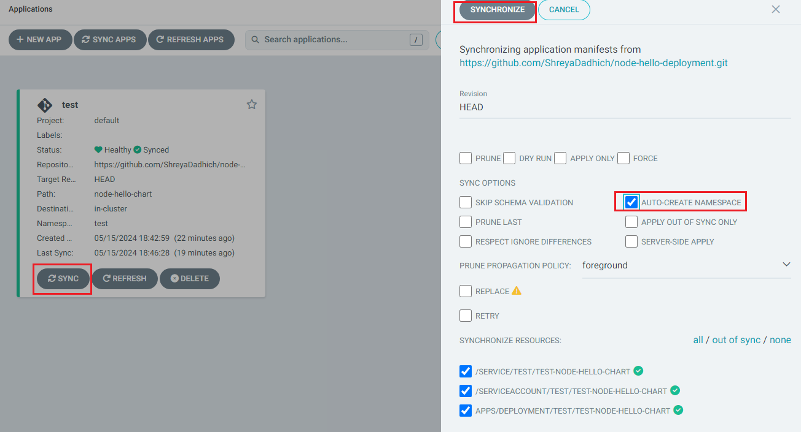


Clicking the app’s card in the web UI allows you to easily inspect the components in the chart. You can also see the relationships between them and take action to force a resync or rollback. These operations can also be achieved using the CLI.

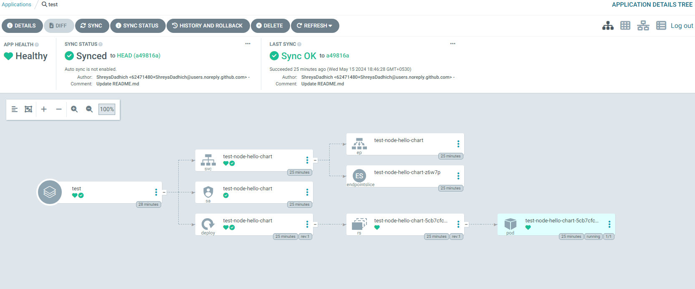

You can now update your deployment by modifying your Helm chart, pushing the changes to GitHub, and initiating a resync within Argo.

### 4. Run node-hello application <a name = "node-hello"></a>

Check status for deployment and pod

```bash
$ kubectl get all -n test
NAME                                         READY   STATUS    RESTARTS   AGE
pod/test-node-hello-chart-5cb7cfc56d-lp9pn   1/1     Running   0          46m

NAME                            TYPE        CLUSTER-IP      EXTERNAL-IP   PORT(S)    AGE
service/test-node-hello-chart   ClusterIP   10.103.18.193   <none>        3000/TCP   46m

NAME                                    READY   UP-TO-DATE   AVAILABLE   AGE
deployment.apps/test-node-hello-chart   1/1     1            1           46m

NAME                                               DESIRED   CURRENT   READY   AGE
replicaset.apps/test-node-hello-chart-5cb7cfc56d   1         1         1       46m
```

Now we will use port forwarding to run **node-hello** application

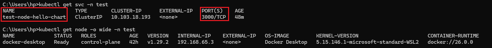

```bash
$ kubectl port-forward svc/test-node-hello-chart -n test 3000:3000
```

Finally you can view the application at http://localhost:3000
