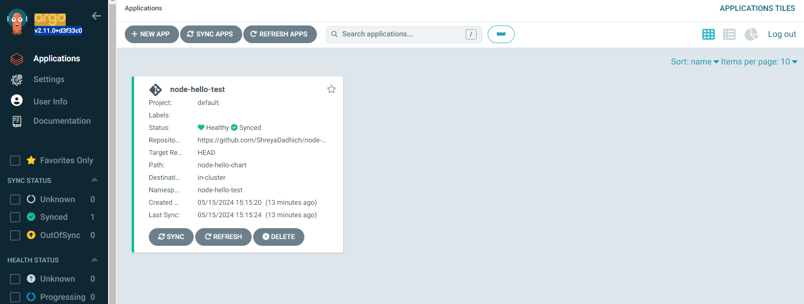
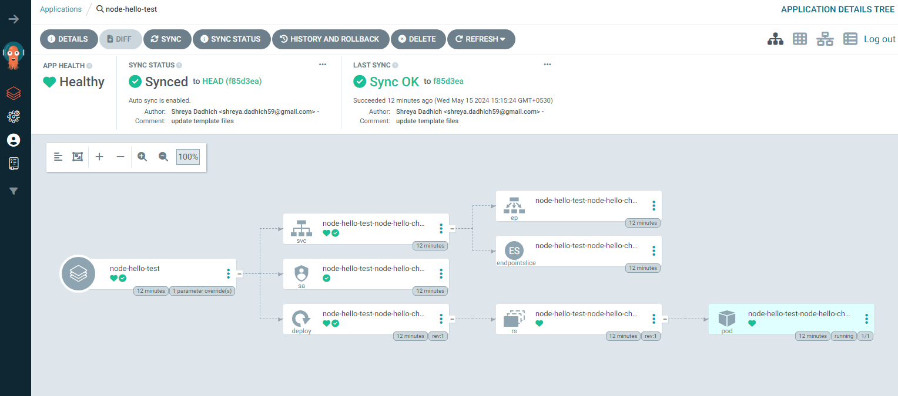

# node-hello-deployment

## 📝 Table of Contents
- [About](#about)
- [Getting Started](#getting_started)
- [Usage](#usage)

## 🧐 About <a name = "about"></a>
Manifest repository for node-hello app deployment

## 🏁 Getting Started <a name = "getting_started"></a>
These instructions will get you a copy of the project up and running on your local machine for development and testing purposes. 

### Install Prerequisites
Follow the documentations to install the following in your environment
1. [Kubernetes](https://kubernetes.io/docs/setup/) - Container management application
2. [Helm](https://helm.sh/docs/intro/install/) - Kubernetes package manager
3. [Argo CD](https://argo-cd.readthedocs.io/en/stable/getting_started/) - GitOps CD tool for Kubernetes

### Create demo **node-hello-test** application on Argo CD
```bash
$ argocd app create node-hello-test \
    --repo https://github.com/ShreyaDadhich/node-hello-deployment.git \
    --path node-hello-chart \
    --dest-server https://kubernetes.default.svc \
    --dest-namespace node-hello-test \
    --sync-option CreateNamespace=true \
    --parameter namespace=node-hello-test \
    --sync-policy manual 
```
> [!NOTE]  
> `sync-policy` can be set to `automated` instead of `manual` which allows argo to automatically sync with the current changes in the application.

The objects defined by the Helm chart will be added to your cluster. 

Your app should now appear when running `argocd app list` and the app’s status should automatically transition to Healthy and Synced in Argo:
```bash
$ argocd app list
NAME                    CLUSTER                         NAMESPACE        PROJECT  STATUS   HEALTH       SYNCPOLICY  CONDITIONS       REPO                                                        PATH              TARGET     
argocd/node-hello-test  https://kubernetes.default.svc  node-hello-test  default  Synced   Healthy      Auto        <none>           https://github.com/ShreyaDadhich/node-hello-deployment.git  node-hello-chart
```

It’ll also be presented in the Argo web UI.



Clicking the app’s card in the web UI allows you to easily inspect the components in the chart. You can also see the relationships between them and take action to force a resync or rollback. These operations can also be achieved using the CLI.



You can now update your deployment by modifying your Helm chart, pushing the changes to GitHub. Argo will automatically sync the changes.

## 🎈 Usage <a name="usage"></a>
Add notes about how to use the system.


